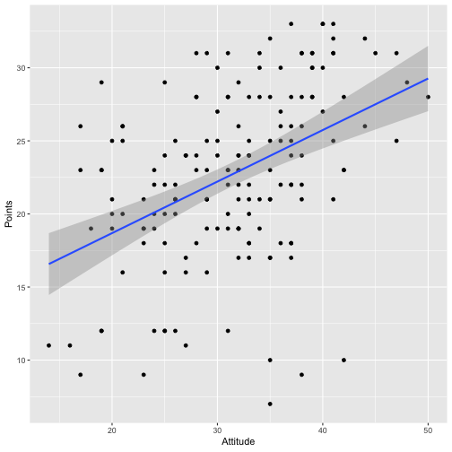
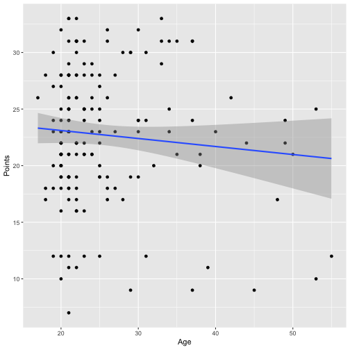
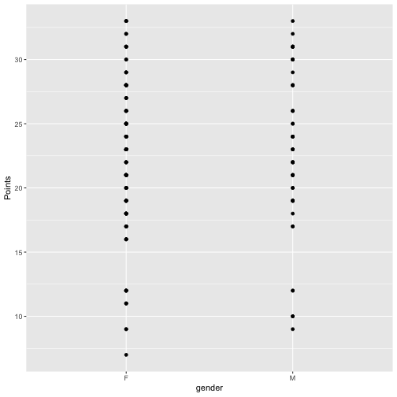
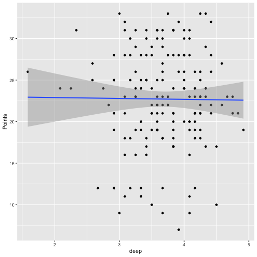
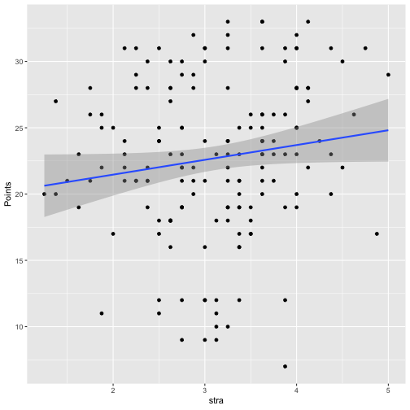
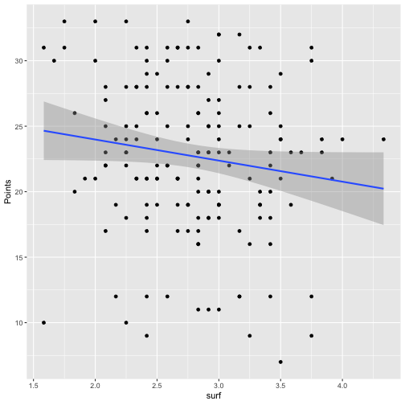

# Regression and model validation

*I have created an appropriate analysis dataset and excluded unwanted observations. Here we have analysis on the dataset and it's variables.*
- Describe your work and results clearly. 
- Assume the reader has an introductory course level understanding of writing and reading R code as well as statistical methods
- Assume the reader has no previous knowledge of your data or the more advanced methods you are using  
For these excercises the libraries "dplyr" and "ggplot2" are necessary

First we read the dataset I created into R and explore its contents, dimensiona and structure

```r
 library("dplyr")
library("ggplot2")
Students2014 <- read.table("~/Documents/IODS-project/data/learning2014/learning2014.txt", header = TRUE, sep = " ")
print(Students2014)
dim(Students2014)
```

```
## [1] 166   7
```

```r
str(Students2014)
```

```
## 'data.frame':	166 obs. of  7 variables:
##  $ gender  : Factor w/ 2 levels "F","M": 1 2 1 2 2 1 2 1 2 1 ...
##  $ Age     : int  53 55 49 53 49 38 50 37 37 42 ...
##  $ Attitude: int  37 31 25 35 37 38 35 29 38 21 ...
##  $ deep    : num  3.58 2.92 3.5 3.5 3.67 ...
##  $ stra    : num  3.38 2.75 3.62 3.12 3.62 ...
##  $ surf    : num  2.58 3.17 2.25 2.25 2.83 ...
##  $ Points  : int  25 12 24 10 22 21 21 31 24 26 ...
```
Next we have summaries for the included variables and scatterplots to clarify their influence on the 'points' -variable:


```r
library(ggplot2)
qplot(Attitude, Points, data = Students2014) + geom_smooth(method = "lm")
```



```r
qplot(Age, Points, data = Students2014) + geom_smooth(method = "lm")
```



```r
qplot(gender, Points, data = Students2014) + geom_smooth(method = "lm")
```



```r
qplot(deep, Points, data = Students2014) + geom_smooth(method = "lm")
```



```r
qplot(stra, Points, data = Students2014) + geom_smooth(method = "lm")
```



```r
qplot(surf, Points, data = Students2014) + geom_smooth(method = "lm")
```




```r
library("knitr")
knit2html("chapter2.Rmd")
```

```
## 
## 
## processing file: chapter2.Rmd
```

```
## 
  |                                                                       
  |                                                                 |   0%
  |                                                                       
  |.........                                                        |  14%
##   ordinary text without R code
## 
## 
  |                                                                       
  |...................                                              |  29%
## label: unnamed-chunk-6
## 
  |                                                                       
  |............................                                     |  43%
##   ordinary text without R code
## 
## 
  |                                                                       
  |.....................................                            |  57%
## label: unnamed-chunk-7
```

```
## 
  |                                                                       
  |..............................................                   |  71%
##   ordinary text without R code
## 
## 
  |                                                                       
  |........................................................         |  86%
## label: unnamed-chunk-8
```

```
## 
  |                                                                       
  |.................................................................| 100%
##   ordinary text without R code
```

```
## output file: chapter2.md
```

